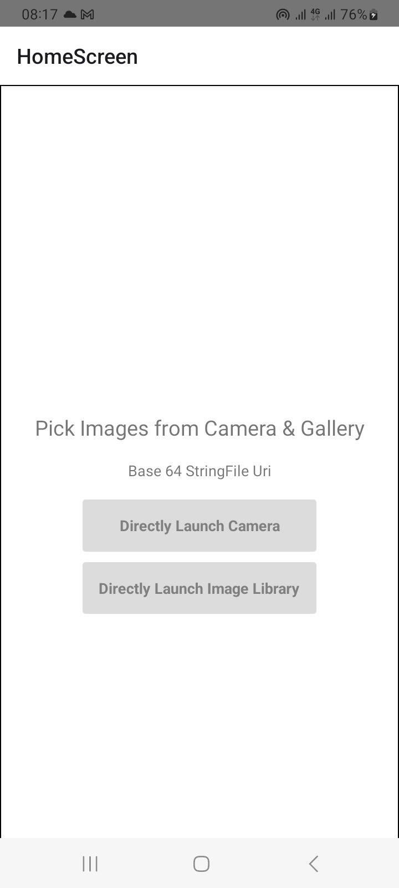
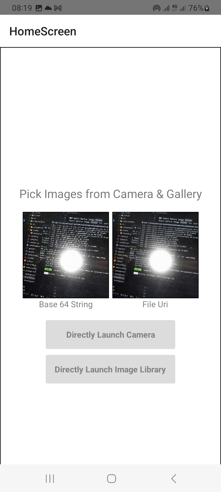
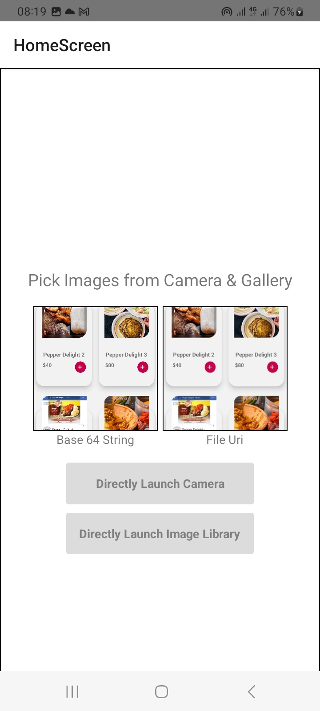

# React Native Image Picker

React Native Image Picker for android and ios

    	# App features
    	1. Pick image from camera and gallery
    	2.  includeBase64
    	3.storageOptions: {
        skipBackup: true,
        path: 'images',
      }

    	# Reference

    	1. [Used rect-native-image-picker](https://github.com/react-native-image-picker/react-native-image-picker)

## Created with:

- React Native CLI.
- Android version: 14
- SDK version: 34
